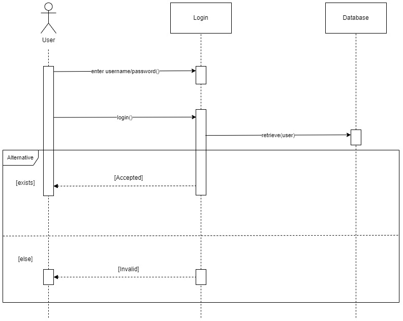
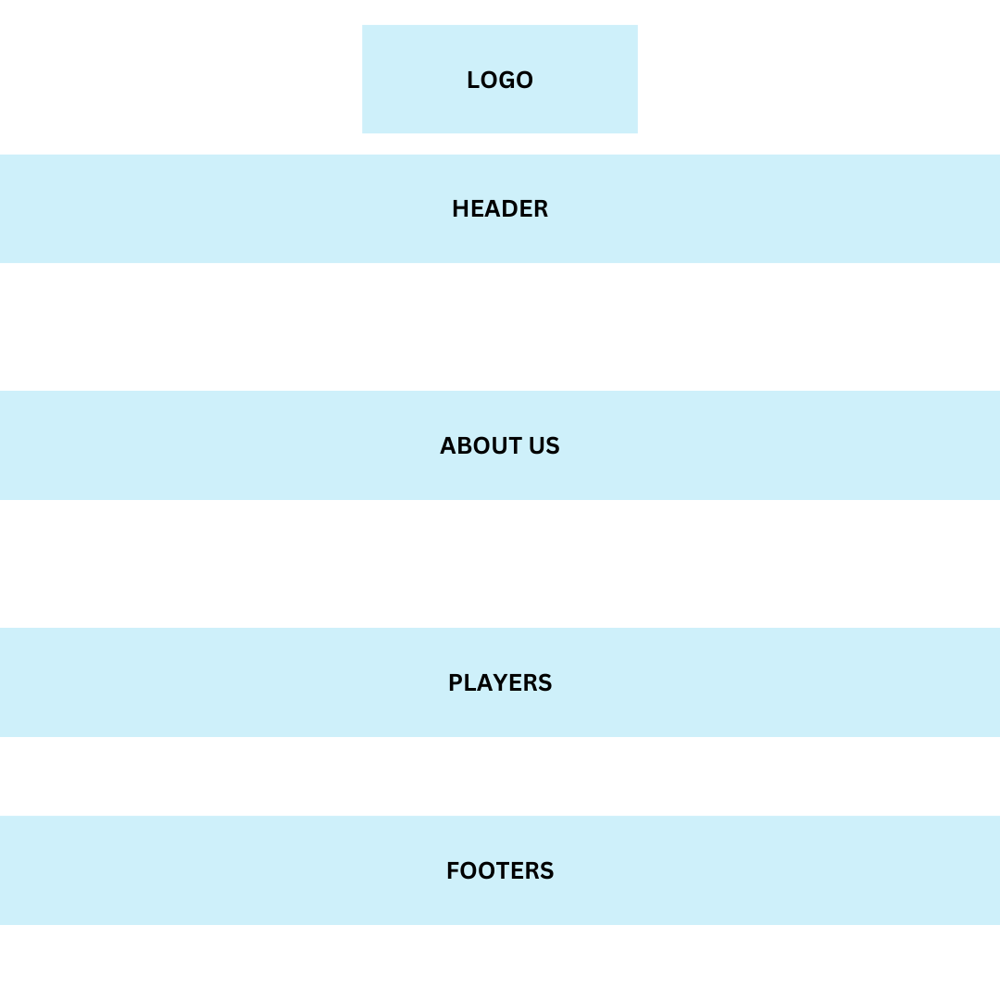

# INFO-3305_sport
GROUP PROJECT  
Group 4
|            Name                 | Matric No |
| ------------------------------- | --------- |
| Muhammad Azim Aizat bin Adnan   | 2115493   |
| Muhammad Mujahid bin Mahazanan  | 2119989   |
| Muhammad Nabil Syahmi bin Zaini | 2110401   |
| Muhammad Zulhilmi bin Mohammed Zerain   | 2113533  |
| Mohamad Nasurudeen Bin Shaik Abdullah   | 2124091  |
| Muhammad Khairul Ikhwan Bin Mohd Iqbal  | 2110753  |    

 
<strong>TITLE OF THE PROJECT</strong>   
<strong>IIUM FUTSAL</strong>

 Introduction:  
  
Welcome to the IIUM Futsal Web Application, a game-changing tool that has been carefully designed to be more than just a digital area. It reflects the balance that exists between our passion for futsal and our unshakable dedication to Shariah compliance. This application, as the beating heart of the International Islamic University Malaysia (IIUM) futsal community, goes on a quest to unite enthusiasts while preserving Islamic ethical norms.   

In a world where connectivity is vital, the IIUM Futsal Web Application serves as a hub for futsal enthusiasts, providing an immersive experience that is consistent with Shariah principles. Every aspect of our digital area is built with a continuous commitment to ethical and Islamic values, whether you're looking for the latest information, participating in community conversations, or researching the rich history of IIUM futsal.  

At the heart of our mission is a commitment to Shariah compliance that extends beyond the traditional limitations of sports platforms. The IIUM Futsal Web Application promotes the concept that passion and principles may coexist. Join us in this digital domain where futsal passion meets the timeless wisdom of Shariah, creating a venue that not only celebrates the sport but also fosters a sense of community through Islamic ideals.  

 Objective:  

The IIUM Futsal Web Application has been intentionally designed to serve as the key center for the International Islamic University Malaysia (IIUM) futsal community. Our major goal is to build a sense of community and togetherness among futsal lovers by providing a dedicated online space for connection, engagement, and the shared celebration of futsal enthusiasm.   

The website also seeks to be a credible source of information, providing real-time updates, news, and events about IIUM futsal to keep the community informed and interested. Our aim includes the promotion of ethical athletic values based on Islamic teachings and sportsmanship. The website facilitates transparent and Shariah-compliant online transactions for the purchase of official IIUM Futsal products and event tickets, with financial transparency being a key focus. The money will be given to the needy. We also have a donation page for people to donate to the ones in need.   

<strong>Features and functionalities</strong>  
- Admin 
  Admin can look at the records and make changes to the site.  
- Sign up/Log in 
  Users can sign up to the website and log in if they already created one.  
- Merchandise/Product
  Users can utilize this app to view and purchase official IIUM Futsal products online. It is a user-friendly e-commerce platform that displays various futsal-related products while encouraging team spirit and solidarity among supporters.  
- Player
  Explore profiles of IIUM futsal players to learn more about their abilities, accomplishments, and contributions to the team. Individual player profiles contain complete information, allowing fans to engage with the players representing IIUM.  
- About Us
  Provides a thorough explanation of IIUM Futsal, including its history, mission, and vision. A part dedicated to providing background information and increasing awareness and admiration for the team and its goals.  
- News
  Keeps users up to date on the newest IIUM Futsal news, activities, and advancements. Real-time news stream that includes articles, announcements, and event coverage to keep the community informed and involved.  
- Donation
  In conformity with Islamic ideals, it facilitates charitable contributions for the benefit of the less fortunate. It is a safe donation platform that guarantees openness, accountability, and the ability to give to worthwhile causes.  
- Ticket
  Users can buy tickets for IIUM Futsal events and matches. It is a user-friendly ticketing system with safe online transactions that promotes event accessibility and community participation.
- Standing/Match
  Updates futsal league standings, player data, and match results in real-time. Dynamic charts and tables display the team's performance and league standing, keeping spectators involved and informed about the competitive side of futsal.   

<strong>Entity Relationship Diagram</strong>  

<strong>Sequence diagram</strong>  

<strong>Mockup page</strong>  
Homepage 

Donation 

Player 

<strong>Project system captured screen and explanation</strong>  
Homepage 
On this page, users can see our header, footers, and a little bit of our content on the main page. The header consists of home, about us, merchandise, news, players, donation, login, register, and match. The user will need to log in to use the full functionality of our website. Overall, this page shows the overview of our website.  

About Us 
It tells what the website is.  

Donation page 
Users can see the donations of other users that have donated to our website.  

Merch page 
Users can buy our merch after logging in to our website. If not an error will occur.  

User Donation page 
Users can make their donation after logging in to our website. If not an error will occur.  

News page 
This page will tell the users about the latest news in the futsal community.  

Match page 
It contains the matches that will be held on a specific date.  

Player page 
The users can see the IIUM Players that represent the futsal team and their brief descriptions.  

Admin page 
A page that is only accessible by the admin. On this page, the admin can add, modify, and delete the contents of the website.  

Edit and delete function 
For example, this all-player page has the function to edit and delete the players that are in the database. it goes the same for others such as donations, news, merchandise, and matches.  

<strong>What is the challenge/difficulties to develop the application</strong>  
1. Testing:

The challenge is to identify and resolve problems, ensure code quality, and conduct thorough testing. 
Solution: Establish comprehensive testing procedures. Test everything after implementing the codes.  

2. Scalability:

The challenge is to ensure that the application can handle greater loads and data without compromising performance. 
Solution: Always test for every coding done.  

3. Designing the User Interface (UI) and User Experience (UX)

Challenge: Creating an intuitive and user-friendly interface. 
Solution: Involve UI/UX designers early in the process, test designs with users, and iterate on the results.  

4. Technology issue:

Challenge: Xampp was not functioning or the VSC was not loading. 
Solution: Refer to videos and lecturers.  

<strong>References</strong>  
Chelsea official page:  
https://www.chelseafc.com/en/  
JDT official page:  
https://johorsoutherntigers.my/  
